# 8 Bit SRAM Mixed Signal Design using eSim with SKY130 PDK & NgVeri
This repository presents the mixed signal design of 8-Bit SRAM implemented using eSIM with SKY130 and NgVeri.

# Table of Contents:
- [Abstract](#Abstract)
- [Block Diagram](#Block-Diagram)
- [6T RAM Cell](#6T-RAM-Cell)
- [3*8 Decoder](#3*8-Decoder)
- [1Bit SRAM Cell](#1Bit-SRAM-Cell)
- [Circuit Schematic Details](#circuit-Schematic-details)
- [Software Used](#software-used)
- [Simulations:](#simulations)
  - [Decoder](##decoder)
  - [6T SRAM](##6T-SRAM)
  - [1Bit SRAM Cell](##1Bit-SRAM-Cell)
  - [Final Simulation of 8 bit SRAM](#Final-Simulation-of-8-bit-SRAM)
- [Netlists](#netlists)
- [Steps to run generate NgVeri Model](#steps-to-run-generate-ngveri-model)
- [Steps to run this project](#steps-to-run-this-project)
- [References](#references)
- [Acknowlegdements](#acknowlegdements)
- [Author](#author)

# Abstract

Memory cells has become a subject of research to meet the demands for future digital electronics and communication systems. One of the memory component is SRAM (Static Random-Access Memory) and is used in various VLSI chips due to its unique capability to retain data. SRAM is a major data storage device due to its large storage density, less time to access and consumes less power. It does not require refreshing periodically which makes it the most popular memory cell among VLSI designers.
Here, have presented work on 6T SRAM cell circuit based on MOSFET is designed for 8-Bit storage with the help of 3*8 decoder.The design is synthesized using the eSim software tool with SKY130 PDK and transient analysis of 8 bit SRAM is performed.

# Block Diagram

The components required are a 3X8 Decoder implemented in digital domain using NgVeri, a 1-bit RAM cell which further consists of writer circuit, 6T RAM cell and a sensory circuit all implemented in analog domain using eSIM with SKY130. 3*8 decoder will be used to select the 1-bit RAM cell to which we want to perform the read/write operation to. Basic block diagram of a 1-bit SRAM will look like this:

   

# 6T RAM Cell

We interconnect all the components to get the below schematic. Then after verifying the functionality the circuit can be converted to a symbol using the Sub-Circuit features. The Symbol and schematic will look as follows:

  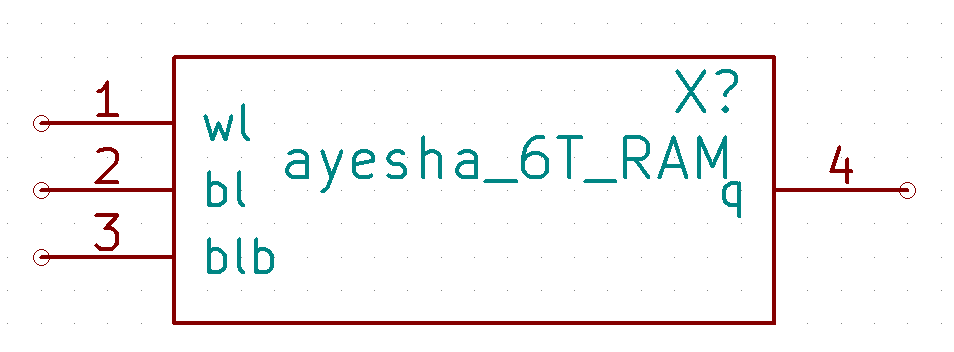 

Here, SRAM cell is designed with two inverters, which are coss-linked like as latch form. This latch is made connection to two bit line along with two transistors M1 and SC6 as shown in Fig. Now both transistors are capable to alter their modes (open or close) under control of word line, and this entire process is controlled by address decoder. When word line goes to ground level then both transistors get turned off, and latch starts to retain own state.

  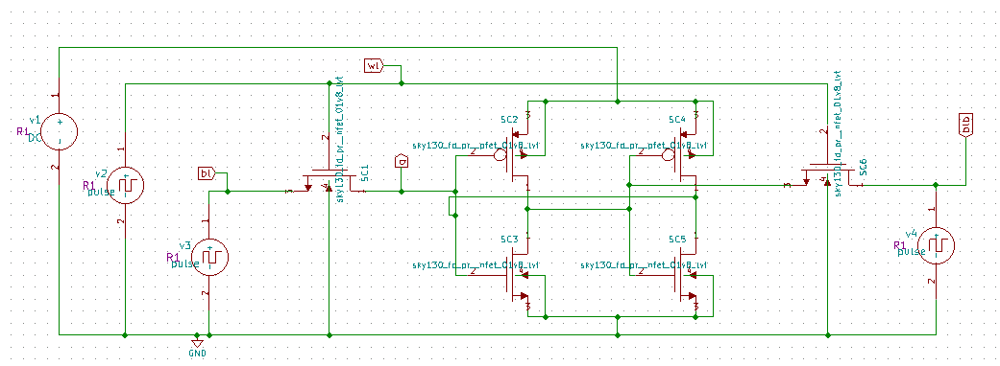 

# 3*8 Decoder

The verilog code for the above decoder is given.

  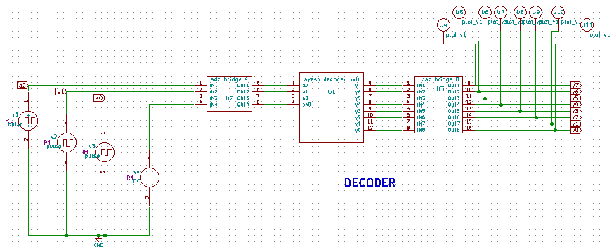 

## Truth Table

  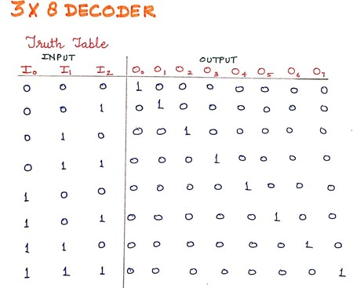 

# Writer Circuit

This circuit provides the input to the 6T SRAM cell. The funtionality of this block is to provide bl and blb to the SRAM cell, when the inputs wl and din are high the bl and blb will also be high else both the outputs will be low. For this design the Writer Circuit has been designed using the NgVeri feature of the eSIM. The Verilog code is given above.

  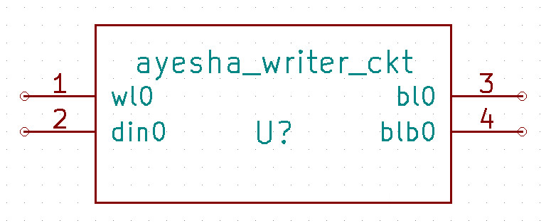 

# 1Bit SRAM Cell

  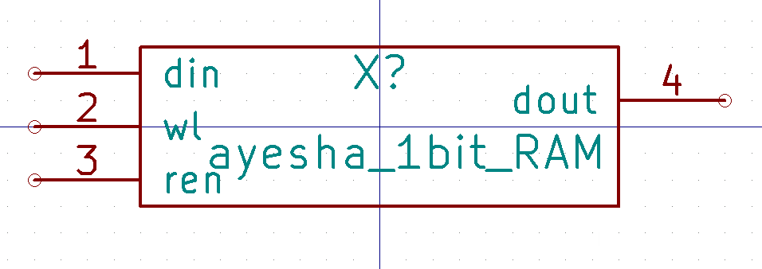 

  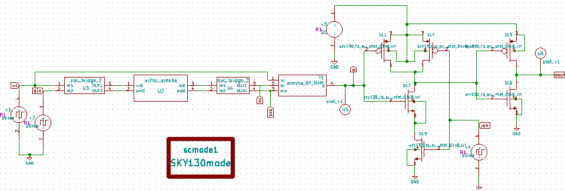 

# Circuit Schematic Details

The following is the schematic in eSim:

   

# Softwares Used:
•  eSim: It is an Open Source EDA developed by FOSSEE, IIT Bombay. It is used for electronic circuit simulation. It is made by the combination of two software namely NgSpice and KiCAD. For more details refer:<a href='https://www.esim.fossee.in/'>Here</a> 

• NgSpice: It is an Open Source Software for Spice Simulations. For more details refer:<a href='http://ngspice.sourceforge.net/docs.html'>Here</a> 

• Makerchip: It is an Online Web Browser IDE for Verilog/System-verilog/TL-Verilog Simulation. Refer: <a href='https://www.makerchip.com/'>Here</a> 

• Verilator: It is a tool which converts Verilog code to C++ objects. Refer: <a href='https://www.veripool.org/verilator/'>Here</a> 

# Simulations:

## Decoder

  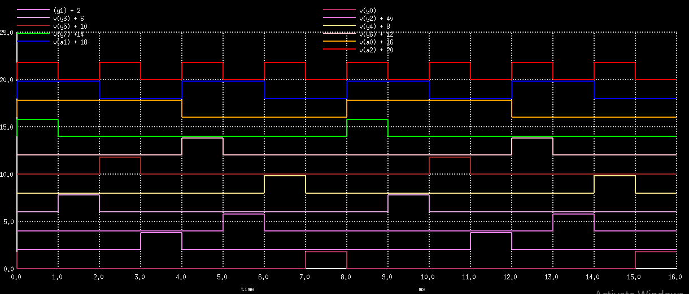 

## 6T SRAM

  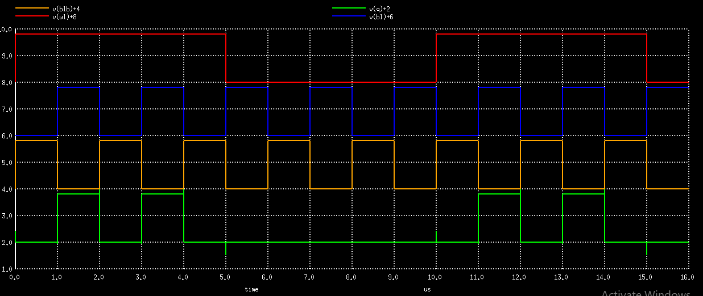 

## 1 Bit SRAM Cell

  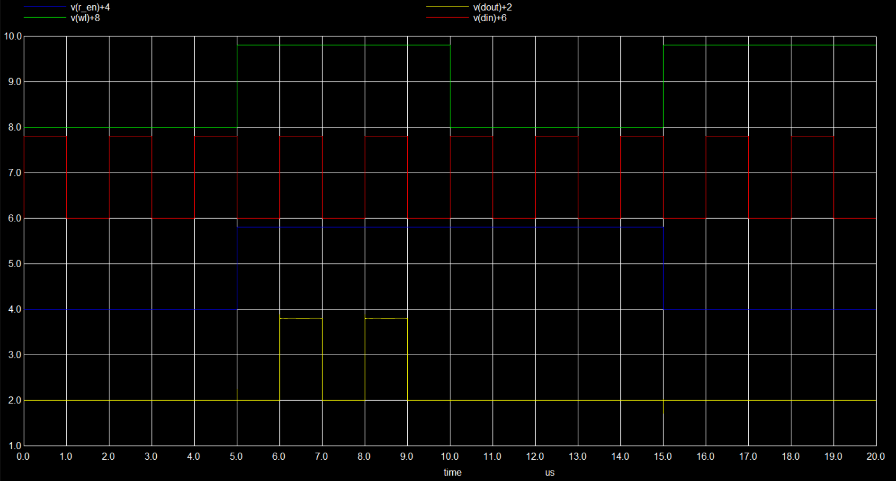 

# Final Simulation of 8 bit SRAM

  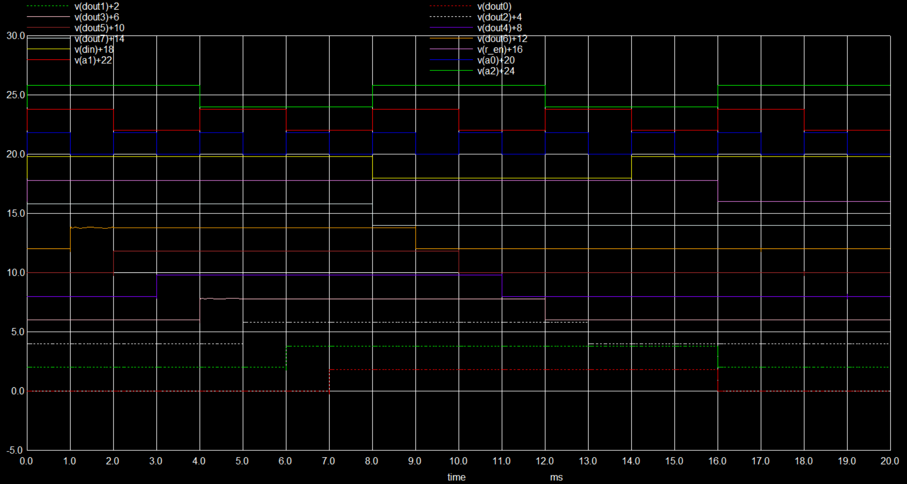 

# Netlists

## Steps to run generate NgVeri Model

1. Open eSim
2. Run NgVeri-Makerchip
3. Add top level verilog file in Makerchip Tab
4. Click on NgVeri tab
5. Add dependency files
6. Click on Run Verilog to NgSpice Converter
7. Debug if any errors
8. Model created successfully

## Steps to run this project

1. Open a new terminal
2. Clone this project using the following command: 
   `git clone https://github.com/aparveen8/8_bit_SRAM_using_mixed_signal.git` 
3. Change directory: 
   `cd eSim_Project_Files/8_bit_SRAM_Ayesha_Parveen/` 
4. Run ngspice: 
   `ngspice 8_bit_SRAM_Ayesha_Parveen.cir.out` 
5. To run the project in eSim:
	- Run eSim 
	- Load the project 
	- Open eeSchema 

# References

1. Ravi Hosamani , Anusha Bhat , Anusha Kalasur, 2020, Design and Analysis of 1-Bit SRAM, IJERT, Volume 09, Issue 09 (September 2020)
2. Datti Atchutarao, V. Kannan “Design and Development of 4-byte SRAM architecture”; IJEET, Vol.11 (July 2020)
3. Subhashree Rath, Siba Kumar Panda “Analysis of 6T SRAM Cell in Different Technologies”; (MCSP-2017), pp:7-10 (September 2017)

# Acknowlegdements

1. FOSSEE, IIT Bombay, https://fossee.in/
2. Steve Hoover, Founder, Redwood EDA
3. Kunal Ghosh, Co-founder, VSD Corp. Pvt. Ltd. - kunalpghosh@gmail.com
4. Sumanto Kar, eSim Team, FOSSEE
5. Indian Institute of Technology Bombay, http://iitb.ac.in/
6. Google, https://www.google.co.in/
7. Spoken Tutorial, https://spoken-tutorial.org/
8. VLSI System Design, https://www.vlsisystemdesign.com/
9. Chips to Startup (C2S), https://www.c2s.gov.in/

# Author

[Ayesha Parveen]([https://github.com/aparveen8]), B.Tech Electronics Engineering, Zakir Husain College of Engineering and Technology (ZHCET), Aligarh Muslim University(AMU), Aligarh.
